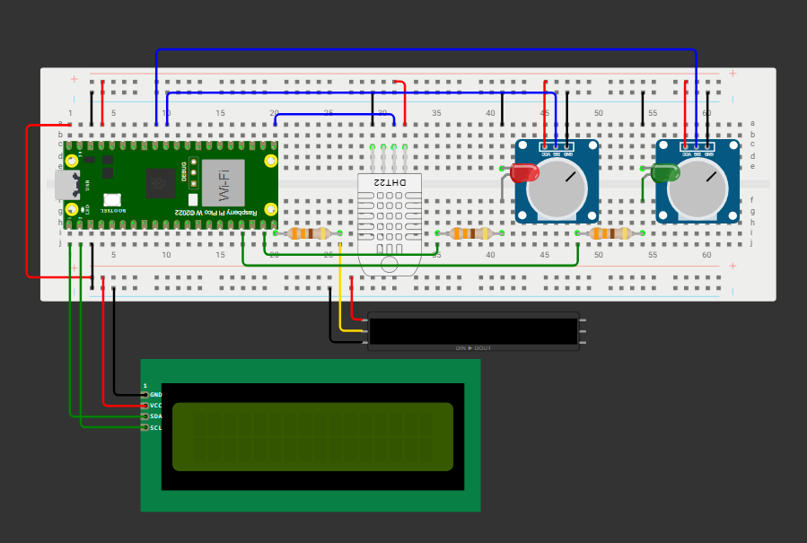
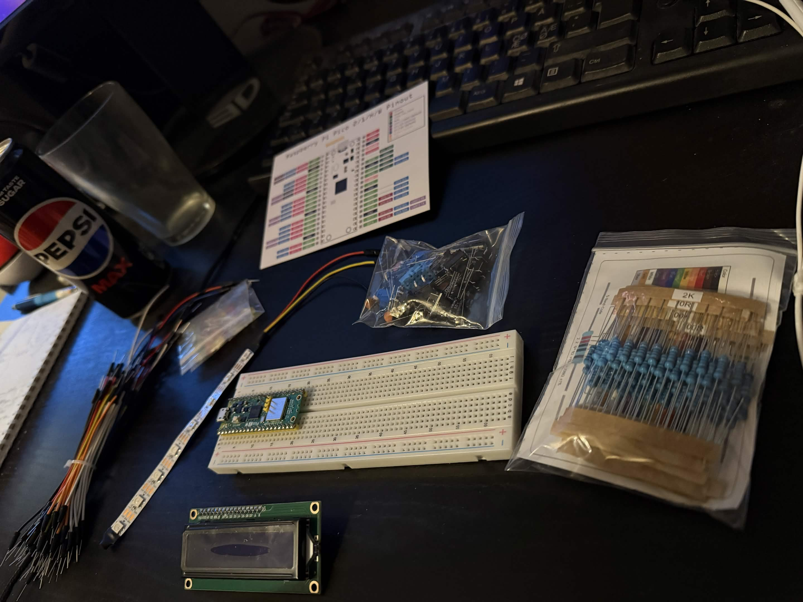
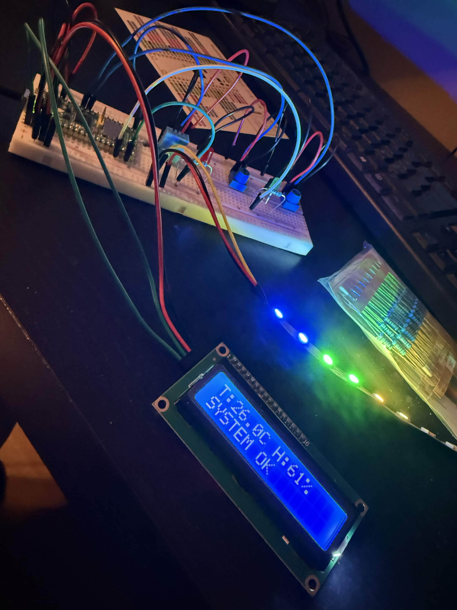
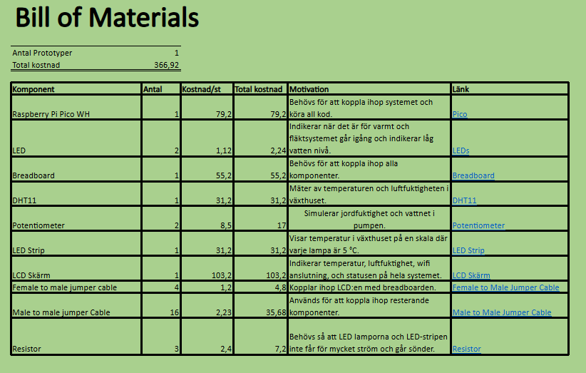

# LIFE
Local Intelligent Farming Enviroment

Grupp projekt repo för våran Edge Computing kurs.

## Projektidé
I det här projektet har vi byggt ett växthus-monitoring-tool, som hjälper användaren ha koll på, reglera och automatisera miljön i ett växthus.
- Vi använder en raspberry pi pico 2 W för att koppla och koda DHT11 som läser av temperatur och luftfuktighet.
- Vi har två potentiometrar som simulerar jordfuktighet och vattnet i pumpen.
- Vi har två LED lampor där en indikerar när det är för varmt och fläkten går igång och en som indikerar om vattennivån är låg.
- Vi har en RGB strip som indikerar hur varmt det är.
- Vi har en LCD skärm där hela systemets information syns.
- IoT pipelinen är: Pico 2 W → Mosquitto (MQTT) → consumer → TimescaleDB → Grafana

## Bilder

### Wokwi simulation

### Bygge

### Färdigbyggd prototyp

### Grafana

### BOM

