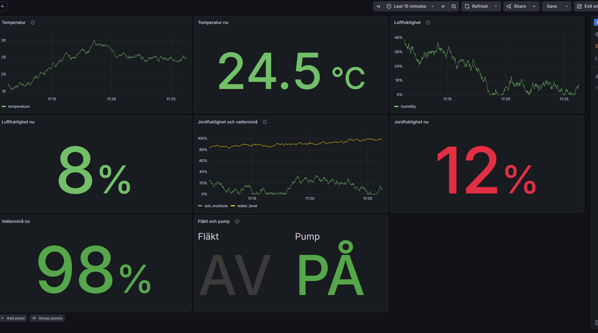

# IoT-pipeline



Tar emot mätvärden från växthuset, lagrar dem och visar dem i realtid.

Pico 2 W → Mosquitto (MQTT) → consumer → TimescaleDB → Grafana

Picon publicerar mätvärden till en MQTT-broker. En consumer prenumererar
på topicen, tolkar meddelandena och skriver dem till TimescaleDB. Grafana
läser databasen och visar dem som grafer och KPI:er.

Brokern i mitten gör att Picon inte behöver känna till databasen. Fler
sensorer eller fler mottagare kan läggas till utan att något annat ändras.

Hela pipelinen körs i Docker och startas med ett kommando.

## Komponenter

| Tjänst | Port | Roll |
|---|---|---|
| Mosquitto | 1883 | MQTT-broker, tar emot och distribuerar meddelanden |
| Consumer | – | Prenumererar på topicen och skriver till databasen |
| TimescaleDB | 5432 | Tidsseriedatabas, lagrar mätvärden |
| Grafana | 3000 | Visualisering |

Consumern har ingen port utåt. Den ansluter själv till brokern och
databasen inifrån Dockers nätverk, där tjänsterna nås på sina namn
(`mosquitto`, `timescaledb`).

## Struktur

```
src_pipeline/
├── docker-compose.yaml        # Alla fyra tjänster
├── dockerfiles/
│   └── consumer.dockerfile    # Bygger consumerns image
├── consumer.py                # MQTT → TimescaleDB
├── init_db.sql                # Tabell och hypertable
├── fake_pico.py               # Testpublicerare utan hårdvara
├── mosquitto/config/          # Brokerns konfiguration
└── grafana/
    ├── dashboard.json         # Exporterad dashboard
    └── dashboard.png
```

## Komma igång

Kräver Docker Desktop.

### 1. Starta pipelinen

```bash
cd src_pipeline
docker compose up -d --build
```

Startar alla fyra tjänster. Databastabellen skapas automatiskt vid
första start. Kontrollera att allt kör:

```bash
docker compose ps
```

### 2. Koppla Grafana till databasen

Öppna http://localhost:3000 och logga in med `admin` / `admin`.

Gå till **Connections → Data sources → Add new data source → PostgreSQL**:

| Fält | Värde |
|---|---|
| Host URL | `timescaledb:5432` |
| Database name | `sensordata` |
| Username | `pico` |
| Password | `pico_dev_password` |
| TLS/SSL Mode | `disable` |
| TimescaleDB | på |

Klicka **Save & test**.

Adressen är `timescaledb`, inte `localhost` — Grafana körs själv i en
container och når databasen på dess tjänstnamn.

### 3. Importera dashboarden

**Dashboards → New → Import**, ladda upp `grafana/dashboard.json` och
välj PostgreSQL-datakällan från steg 2.

## Testa utan hårdvara

`fake_pico.py` publicerar påhittade mätvärden till brokern. Den körs
utanför Docker, precis som den riktiga Picon. Kräver
[uv](https://docs.astral.sh/uv/):

```bash
uv run fake_pico.py
```

Följ consumern för att se att värdena tas emot:

```bash
docker compose logs -f consumer
```

## Vanliga kommandon

```bash
docker compose up -d --build   # Starta, bygg om consumern vid ändringar
docker compose ps              # Visa status
docker compose logs -f consumer  # Följ consumerns logg
docker compose down            # Stoppa allt, datan sparas
```

`docker compose down -v` raderar även volymerna, alltså alla mätvärden
och Grafana-inställningar. Använd bara om ni vill börja om helt.

## MQTT-format

Topic: `greenhouse/data`

```json
{
  "temperature": 24.0,
  "humidity": 45,
  "soil_moisture": 38,
  "water_level": 72,
  "fan_on": false,
  "pump_on": true
}
```

Tidsstämpeln sätts av consumern när meddelandet tas emot, eftersom Picon
saknar en tillförlitlig klocka.

## Att tänka på

- Picon kan inte ansluta till `localhost` — den behöver IP-adressen till
  datorn där brokern körs, på samma nätverk.
- Picon stöder bara 2,4 GHz-nätverk.
- Windows-brandväggen kan blockera inkommande trafik på port 1883.
  Anslutningen från Picon misslyckas då trots att wifi fungerar.
- Mosquitto sparar inga meddelanden. Consumern startar automatiskt med
  pipelinen, men meddelanden som skickas innan den är uppe går förlorade.
- Consumern startar om sig själv om den kraschar (`restart: unless-stopped`).
- Databastabellen skapas bara automatiskt när databasvolymen är tom. Finns
  volymen redan sedan tidigare, kör en gång manuellt:
  `docker exec -i pico_timescaledb psql -U pico -d sensordata < init_db.sql`
- Lösenordet i `docker-compose.yaml` är ett utvecklingslösenord och ska
  flyttas till en `.env`-fil om pipelinen körs skarpt.

## LLM-användning

Delar av koden i denna mapp är framtagen med hjälp av LLM och har
gåtts igenom av gruppen.